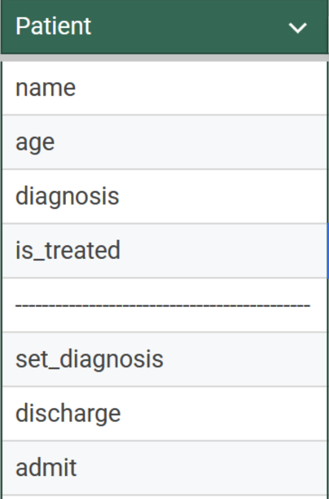
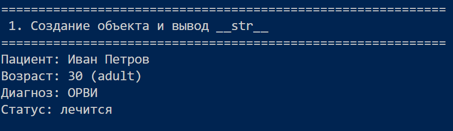
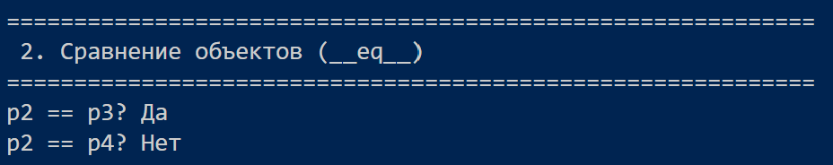
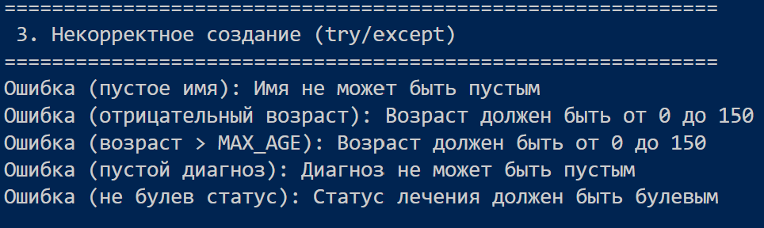
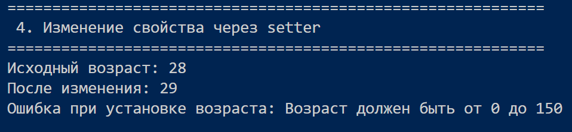
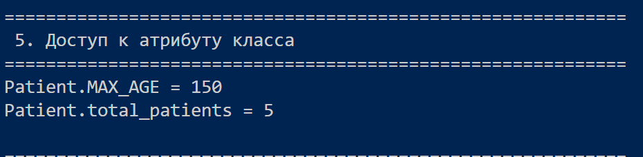
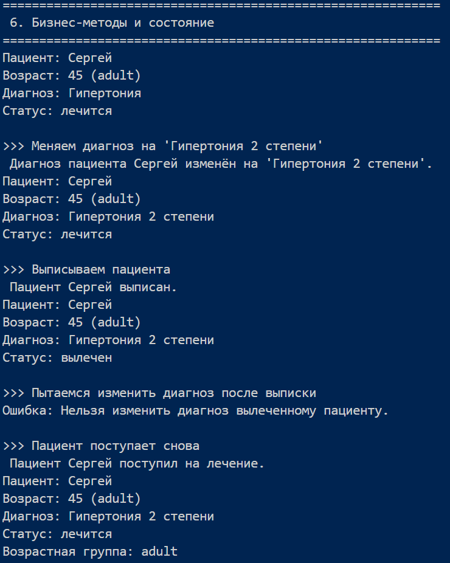
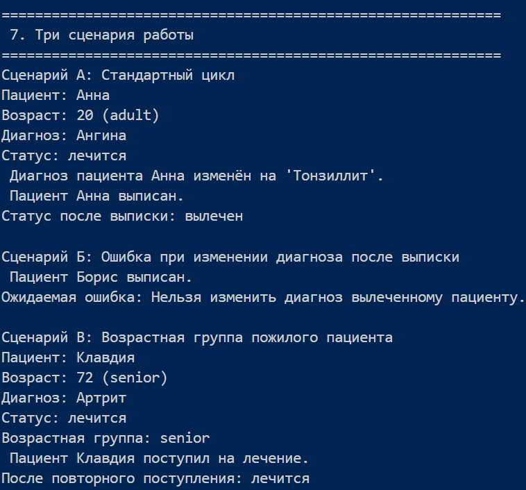

# Лабараторная работа №1
## Схематичный вид оформеления класса:

## Вопросы для более глубокого понимая класса:
### Вопрос 1. Что является сущностью?
Сущностью является класс Patient (пациент)

### Вопрос 2. Какие у него атрибуты?
У класса есть следующие закрытые атрибуты:

1) __name – имя (строка);

2) __age – возраст (целое число);

3) __diagnosis – диагноз (строка);

4) __is_treated – статус лечения (булево значение).

А также атрибуты класса:

1) total_patients – общее количество созданных экземпляров;

2) MAX_AGE – максимально допустимый возраст (150).

### Вопрос 3. Какие инварианты?
Инварианты – условия, которые всегда соблюдаются для корректного объекта:

1) Имя – непустая строка;

2) Возраст – целое число от 0 до MAX_AGE (включительно);

3) Диагноз – непустая строка;

4) Статус лечения – булево значение (True или False).

### Вопрос 4. Когда два объекта считаются равными?
Два объекта Patient считаются равными, если у них совпадают имена. Возраст, диагноз и статус лечения при этом не учитываются.

### Вопрос 5. Есть ли состояние?
Да, объекты обладают состоянием, которое определяется текущими значениями атрибутов. Состояние может изменяться:

1) через методы admit() и discharge() (меняют статус лечения);

2) через set_diagnosis() (меняет диагноз, но только если пациент не вылечен);

3) через сеттеры свойств (изменение имени, возраста, диагноза, статуса с проверкой инвариантов).

4) Поведение объекта зависит от состояния: например, вызов set_diagnosis() после выписки вызывает исключение.
## Пример реализации кода:

### Создание обьекта
### Вывод:

 
 ### Сравнение обьектов
 

### Если создание обьекта неккоректно

### Изменение свойств через setter

### Доступ к атрибуту класса

### Методы и изменение состояния

### Три сценария с описанием

#### Описание
##### Сценарий А: Стандартный цикл лечения

1) Создаётся пациент Анна с диагнозом «Ангина».

2) Выводится информация через __str__.

3) Изменяется диагноз на «Тонзиллит» (метод set_diagnosis).

4) Пациент выписывается (discharge), статус становится «вылечен».

5) Проверяется, что после выписки статус изменился.

Этот сценарий демонстрирует: поступление, изменение диагноза, выписка.
##### Сценарий Б: Попытка изменить диагноз после выписки

1) Создаётся пациент Борис с диабетом.

2) Сразу выполняется выписка (discharge).

3) Пытаемся изменить диагноз через set_diagnosis.

4) Возникает ValueError т.к нельзя изменить диагноз вылеченному пациенту.

Сценарий показывает зависимость поведения от состояния – метод set_diagnosis разрешён только когда is_treated == False.
##### Сценарий В: Пожилой пациент и повторное поступление

1) Создаётся пациент Клавдия (72 года) с артритом.

2) Выводится информация, включая возрастную группу (senior).

3) Пациент выписывается (discharge).

4) Затем снова поступает (admit), статус возвращается к «лечится».

5) Проверяется, что после повторного поступления статус корректен.

Этот сценарий демонстрирует определние возраста(метод get_age_group) и возможность повторного изменения состояния.

Все три сценария вместе покрывают ключевые аспекты: создание, валидация, изменение состояния, проверка инвариантов и реакция на некорректные действия.