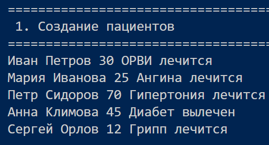
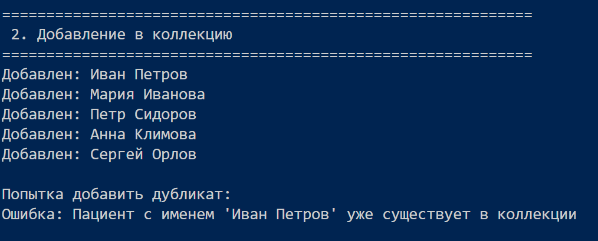
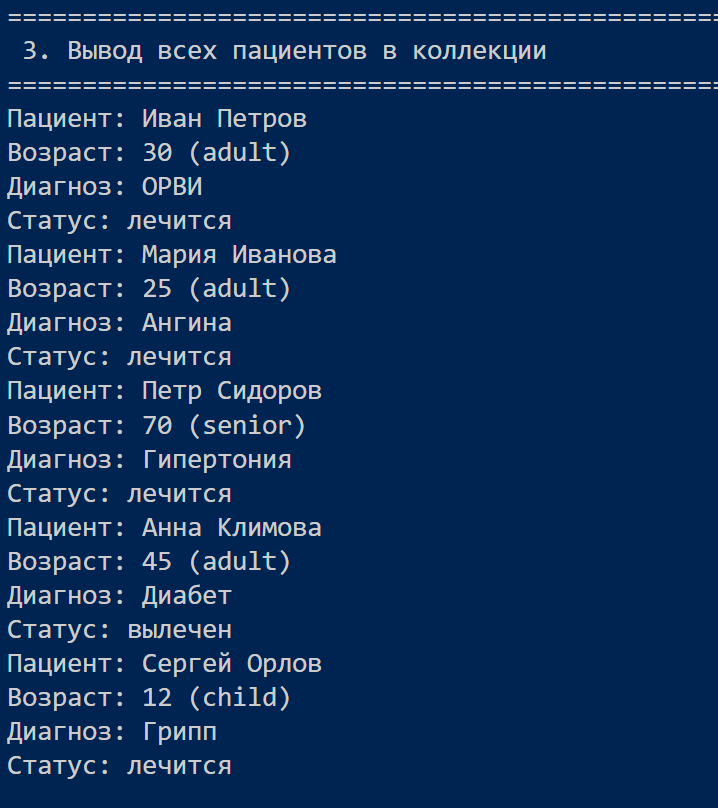
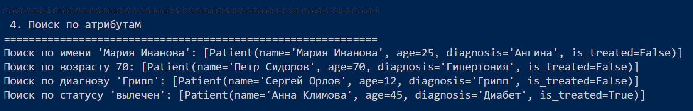
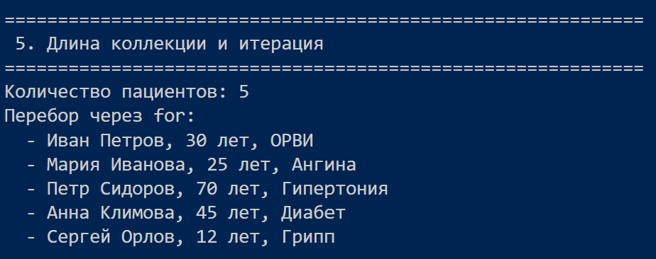
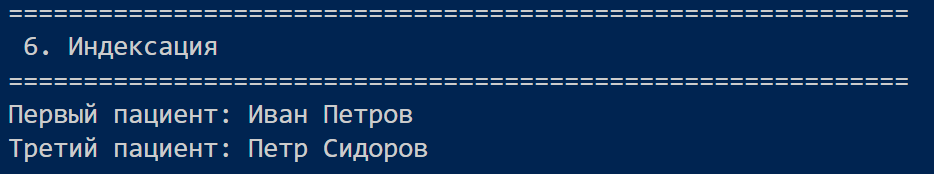
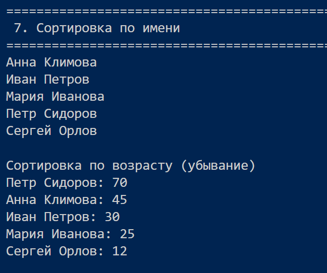
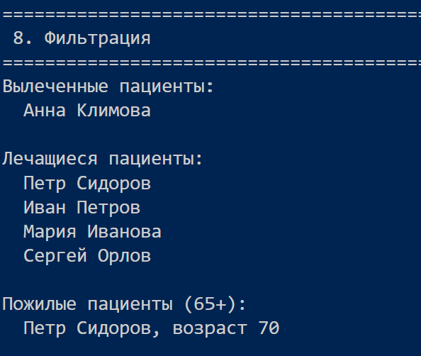
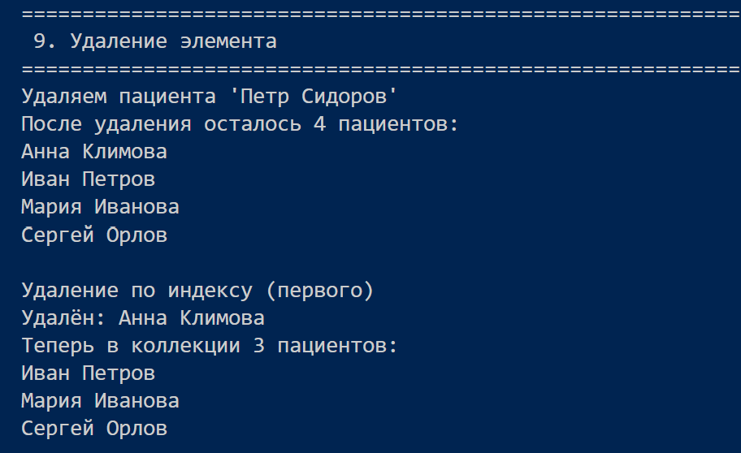
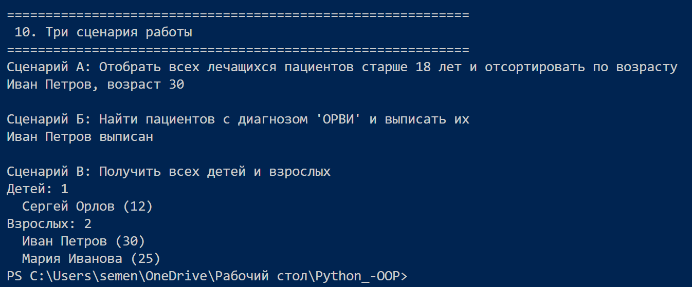

# Лабараторная работа №2
## Цель
- Научиться работать с коллекциями объектов.

- Понять разницу между моделью сущности и контейнером объектов.
- Реализовать собственный контейнерный класс.

- Освоить итерацию по объектам.

- Реализовать базовые операции управления коллекцией.

## Реализованный класс
`PatientCollection` - коллекция, хранящая объекты `Patient` во внутреннем списке `self._items`.

## Основные методы
- `add(patient)` - добавляет пациента (с проверкой типа и запретом дубликатов по имени)

- `remove(patient)` - удаляет пациента по объекту

- `remove_at(index)` - удаляет по индексу

- `get_all()` - возвращает список всех пациентов

- `__len__()` - возвращает количество пациентов

- `__iter__()` - позволяет использовать `for p in collection`

- `__getitem__(index)` - доступ по индексу `collection[i]`

## Поиск
- `find_by_name(name)` - по имени

- `find_by_age(age)` - по возрасту

- `find_by_diagnosis(diagnosis)` - по диагнозу

- `find_by_status(is_treated)` - по статусу лечения

## Сортировка
- `sort_by_name()` - по имени

- `sort_by_age()` - по возрасту

- `sort_by_diagnosis()` - по диагнозу

## Фильтрация (логические операции, возвращают новую коллекцию)
- `get_treated()` - вылеченные пациенты
- `get_untreated()` - лечащиеся
- `get_by_age_group(group)` - дети, взрослые, пожилые

## В чем же разница между моделью сущности и контейнером объектов?
- Сущность отвечает за свои данные и поведение.

- Контейнер отвечает за хранение, поиск и управление группой.

## Демонстрация работы файла `demo.py`:
1. Создание нескольких объектов Patient

2. Создание коллекции и добавление

3. Вывод всех элементов

4. Поиск

5. Использование len() и for

6. Индексация

7. Сортировка

8. Фильтрация

9. Удаление элемента

10. Три сценария работы:
- Сценарий А: фильтрация + сортировка
- Сценарий Б: Поиск по диагнозу и изменение статуса
- Сценарий В: Работа с возрастными группами

