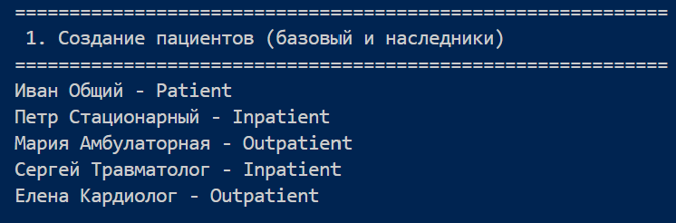
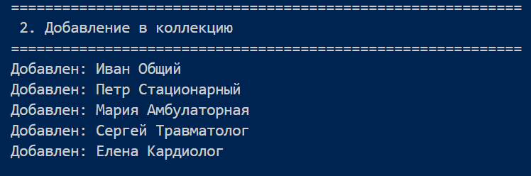
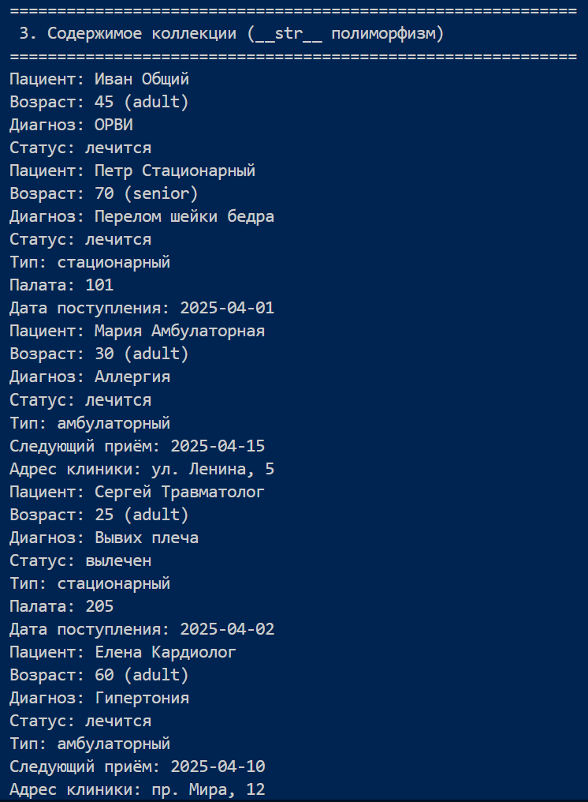
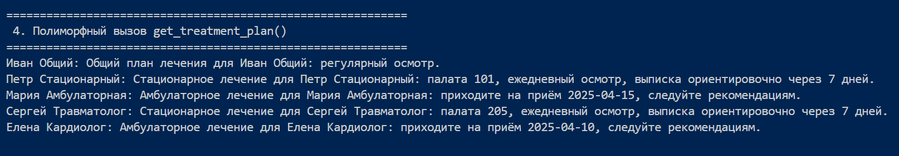
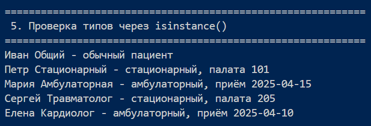
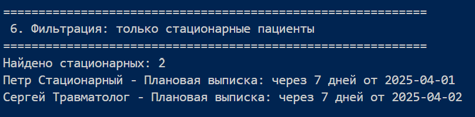
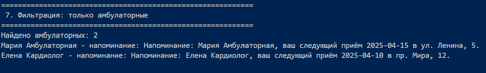
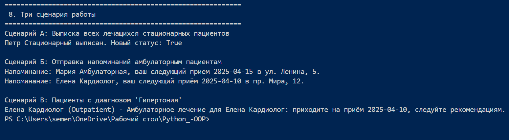

# Лабораторная работа №3: Наследование и иерархия классов

## 1. Цель работы

- Освоить механизм наследования классов.

- Научиться строить иерархию объектов.

- Понять разницу между:

- базовым классом  

- производным классом

- Научиться переиспользовать код.

- Освоить переопределение методов.

## 2. Описание реализованной иерархии классов

### Базовый класс – `Patient`
- **Атрибуты:** `name`, `age`, `diagnosis`, `is_treated`.

- **Методы:** `admit()`, `discharge()`, `set_diagnosis()`, `get_age_group()`, `get_treatment_plan()`.

- **Специальные методы:** `__str__`, `__repr__`, `__eq__`, `__hash__`.

### Производные классы

| Класс | Новые атрибуты | Новый метод | Отличия в поведении |
|-------|---------------|-------------|---------------------|
| **`Inpatient`** (стационарный) | `ward_number` (палата), `admission_date` (дата поступления) | `discharge_planned_date(days=7)` – планируемая дата выписки | План лечения: стационарное (палата, ежедневный осмотр) |
| **`Outpatient`** (амбулаторный) | `next_appointment` (следующий приём), `clinic_address` (адрес клиники) | `reminder()` – напоминание о приёме | План лечения: амбулаторное (явка в поликлинику, рекомендации) |

Оба наследника используют `super() `,` __init__()` для вызова конструктора базового класса, переопределяют методы `__str__` (добавляют специфичную информацию) и `get_treatment_plan()` (реализуют разное поведение).

### Класс-контейнер `PatientCollection`
- Обеспечивает хранение объектов `Patient` и его наследников, добавление, удаление, поиск, сортировку, итерацию, индексацию.

## 3. Демонстрация работы (сценарии из `demo.py`)

**1. Создание пациентов**

**2. Добавление в коллекцию**

**3. Содержимое коллекции**

**4. Полиморфизм**

**5. Проверка типа данных**

**6. Фильтрация стационарных пациентов**

**7. Фильтрация амбулаторных пациентов**

**8. Реализованные сценарии**

### Сценарий А: Выписка всех лечащихся стационарных пациентов
- Перебираются объекты типа `Inpatient` из коллекции.
- Для каждого, у кого `is_treated == False`, вызывается метод `discharge()`.
- Выводится сообщение о выписке.

### Сценарий Б: Отправка напоминаний амбулаторным пациентам
- Перебираются объекты типа `Outpatient`.
- Для каждого вызывается метод `reminder()`, возвращающий текст напоминания о следующем приёме.

### Сценарий В: Поиск пациентов с диагнозом "Гипертония"
- Фильтрация коллекции по значению атрибута `diagnosis` (без учёта регистра).
- Для каждого найденного пациента выводится его тип и план лечения (полиморфный метод `get_treatment_plan()`).

## 4. Вывод

В ходе лабораторной работы были изучены и применены на практике:

- **Наследование** – создание дочерних классов `Inpatient` и `Outpatient` от базового `Patient` с добавлением новых атрибутов и методов, переиспользование кода через `super()`.
- **Полиморфизм** – единый интерфейс метода `get_treatment_plan()`: вызов этого метода для объектов разных типов приводит к разному поведению (стационарный план vs амбулаторный план) без использования условных операторов `if type == ...`.
- **Интеграция с коллекцией** – контейнер `PatientCollection` из ЛР-2 успешно хранит объекты всех типов иерархии, а фильтрация по типу позволяет получать подмножества объектов.
- **Инкапсуляция и валидация** – сохранены из ЛР-1, что обеспечивает корректность данных.