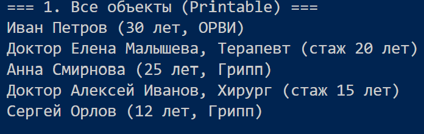
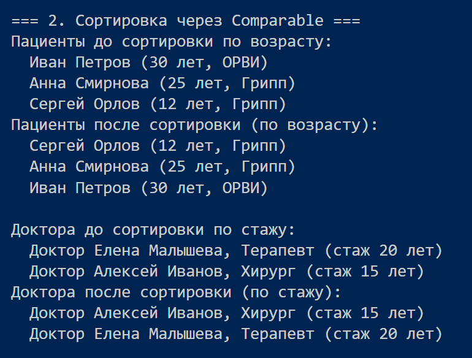
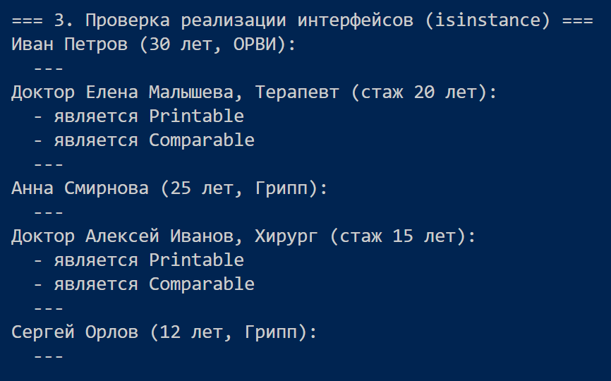
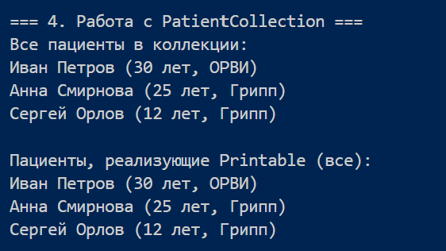
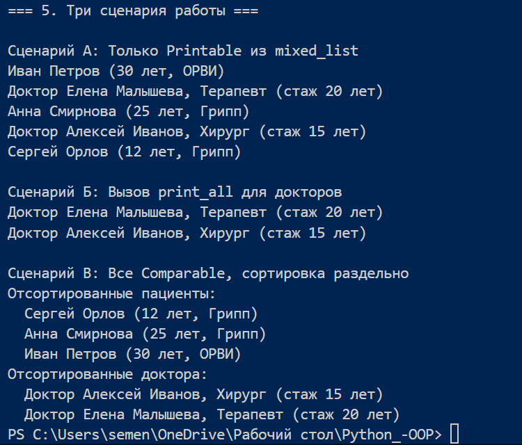

# Лабораторная работа №3: Интерфейсы и полиморфизм

## 1. Цель работы

- Познакомиться с **абстрактными базовыми классами (ABC)** в Python.
- Освоить понятие **интерфейса (контракта поведения)** – набора методов, которые класс обязан реализовать.
- Научиться **задавать обязательные методы для классов** с помощью `@abstractmethod`.
- Закрепить **полиморфизм через единый интерфейс** – работа с разными объектами через общий контракт.
- Научиться **проектировать архитектуру**, выделяя интерфейсы, а не просто создавать отдельные классы.

---

## 2. Описание интерфейсов

В файле `interfaces.py` определены два абстрактных базовых класса (интерфейса):

| Интерфейс | Абстрактный метод | Назначение |
|-----------|------------------|------------|
| `Printable` | `to_string() -> str` | Возвращает строковое представление объекта. |
| `Comparable` | `compare_to(other) -> int` | Сравнивает текущий объект с другим. Возвращает отрицательное число, 0 или положительное в зависимости от результата сравнения. |

Оба интерфейса наследуются от `ABC` и используют декоратор `@abstractmethod`.

---

## 3. Реализация в классах

Интерфейсы реализованы в двух классах:

- **`Patient`** (класс из ЛР-1, дополненный методами `to_string()` и `compare_to()`)
- **`Doctor`** (новый класс, созданный в рамках ЛР-3)

### Поведение методов

| Класс | `to_string()` | `compare_to()` |
|-------|--------------|----------------|
| `Patient` | `"Иван Петров (30 лет, ОРВИ)"` | Сравнивает по возрасту (`self.age - other.age`) |
| `Doctor` | `"Доктор Елена Малышева, Терапевт (стаж 20 лет)"` | Сравнивает по стажу (`self.years - other.years`) |

Оба класса реализуют **оба интерфейса** (множественное наследование).

---

## 4. Демонстрация

Скрипт `demo.py` демонстрирует:

1. **Работу функции через интерфейс `Printable`** – `print_all()` принимает список `Printable` и вызывает `to_string()` у каждого объекта. В список передаются объекты `Patient` и `Doctor` (разные типы).

2. **Использование `isinstance()`** – проверка, реализует ли объект тот или иной интерфейс, а также **Подтверждение множественной реализации** – каждый объект является одновременно `Printable` и `Comparable`.

3. **Сортировку через интерфейс `Comparable`** – функция `sort_comparable()` сортирует список объектов, использующих `compare_to()` (отдельно для пациентов и докторов, чтобы избежать некорректного сравнения разных типов).

4. **Интеграцию с коллекцией `PatientCollection` из ЛР-2** – фильтрация элементов коллекции по интерфейсу.

5. **Три сценария работы**:
   - **Сценарий А** – получение только `Printable` объектов из смешанного списка.
   - **Сценарий Б** – вызов `print_all()` для подсписка (доктора).
   - **Сценарий В** – фильтрация всех `Comparable` объектов и их сортировка (раздельно по типам).
   

