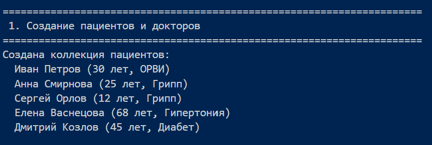
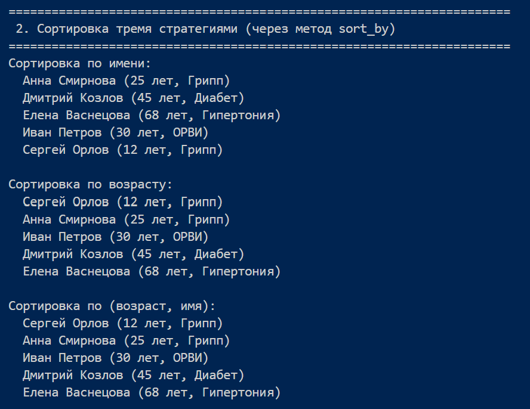
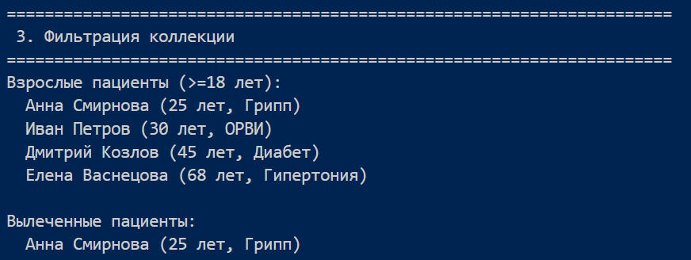
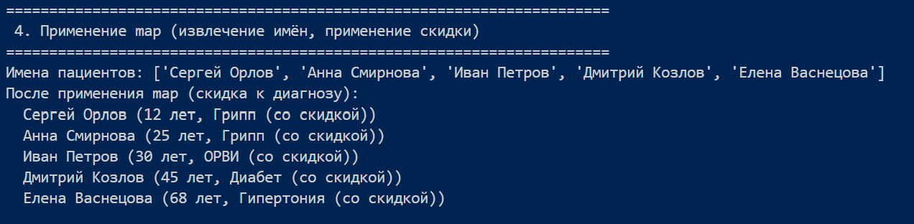
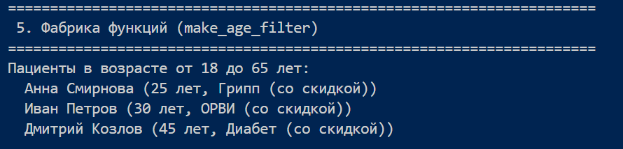
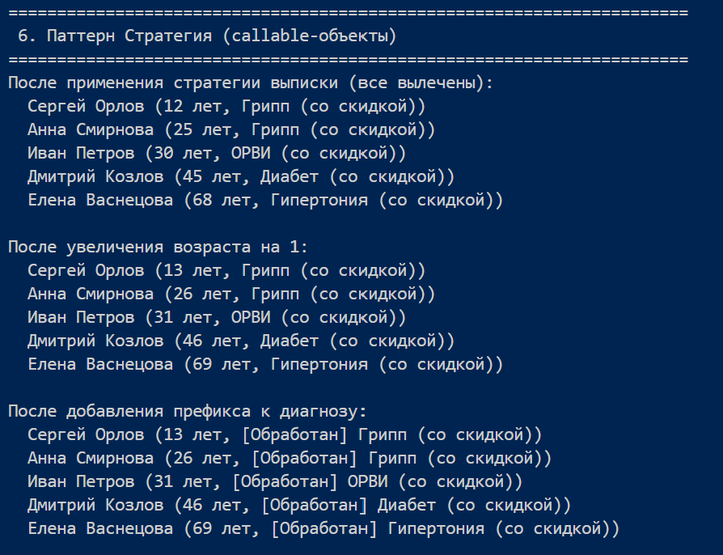
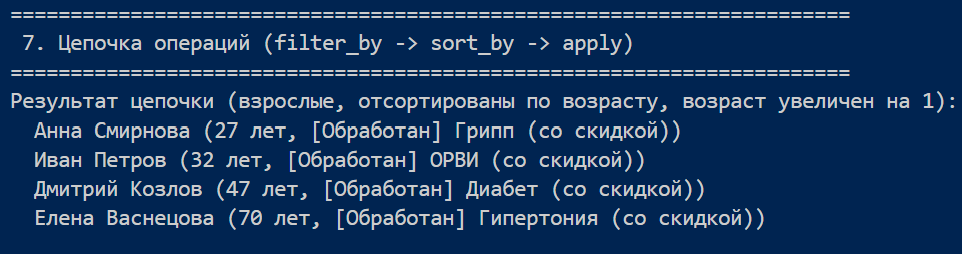
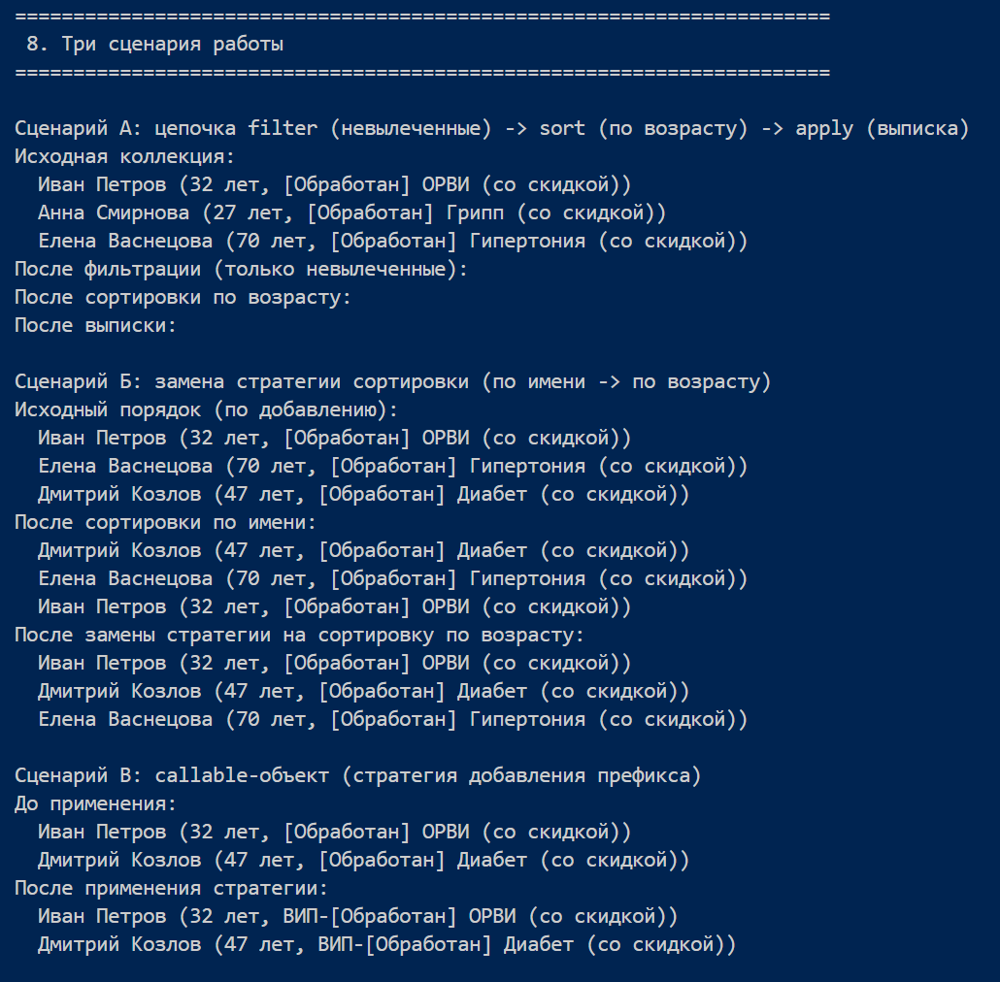

# Лабораторная работа №5: Функции как аргументы. Стратегии и делегаты.

## 1. Цель работы

- Освоить передачу функций как аргументов в другие функции и методы.
- Научиться применять встроенные функции высшего порядка: `map`, `filter`, `sorted`.
- Понять концепцию паттерна «Стратегия» и реализовать его на Python.
- Освоить `lambda`-выражения и их практическое применение.
- Интегрировать функциональный стиль с объектно-ориентированным кодом из предыдущих ЛР.

## 2. Реализованные функции и стратегии

### 2.1 Функции-стратегии сортировки (ключи)

| Функция | Назначение |
|---------|------------|
| `by_name(obj)` | Ключ сортировки по имени (работает для `Patient` и `Doctor`) |
| `by_age(obj)` | Ключ сортировки по возрасту (только для `Patient`) |
| `by_diagnosis(obj)` | Ключ сортировки по диагнозу (для `Patient`) |
| `by_years(obj)` | Ключ сортировки по стажу (для `Doctor`) |
| `by_age_then_name(obj)` | Комбинированная сортировка: возраст → имя |

### 2.2 Функции-фильтры (предикаты)

| Функция | Условие |
|---------|---------|
| `is_adult(patient)` | возраст ≥ 18 |
| `is_child(patient)` | возраст < 18 |
| `is_senior(patient)` | возраст ≥ 65 |
| `is_treated(patient)` | `is_treated == True` |
| `is_untreated(patient)` | `is_treated == False` |
| `is_doctor(obj)` | объект является экземпляром `Doctor` |
| `is_patient(obj)` | объект является экземпляром `Patient` |

### 2.3 Фабрика функций

`make_age_filter(min_age, max_age)` – возвращает функцию-предикат, проверяющую, находится ли возраст объекта в заданном диапазоне. Пример:
### 2.4 Функции высшего порядка (встроенные)

* `map()` – извлечение имён, преобразование диагнозов.

* `filter()` – фильтрация по типу объекта (is_doctor).

* `sorted()` – сортировка с lambda и с именованной функцией.

### 2.5 Паттерн «Стратегия» (callable-объекты)

Классы с методом __call__, которые передаются в apply() коллекции:

* DischargeStrategy – выписывает пациента (is_treated = True).

* IncrementAgeStrategy – увеличивает возраст на 1.

* AddPrefixToDiagnosis – добавляет префикс к диагнозу.

Эти стратегии можно менять без изменения кода коллекции.
### 2.6 Расширение коллекции PatientCollection

Добавлены методы:

* `sort_by(key_func, reverse=False)` – сортировка in‑place, возвращает self.

* `filter_by(predicate)` – возвращает новую коллекцию.

* `apply(func)` – применяет функцию ко всем элементам, возвращает self.
## 3. Демонстрация работы
1. **Создание пациентов и докторов**

2. **Сортировка тремя стратегиями**

3. **Фильтрация коллекции**

4. **Применение map**

5. **Фабрика функций**

6. **Паттерн Стратегия**

7. **Цепочка операций**

8. **Три сценария работы**

## 4. Вывод

### Что было изучено:

* передача функций как аргументов
* lambda, map, filter
* функции высшего порядка и замыкания
* паттерн Стратегия
