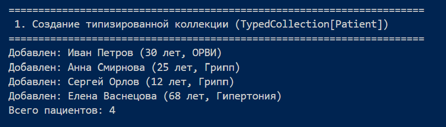
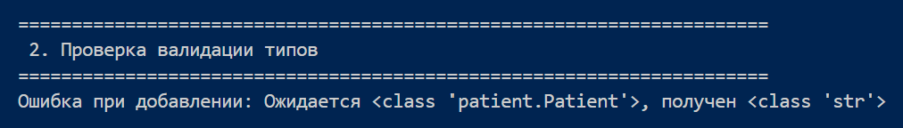
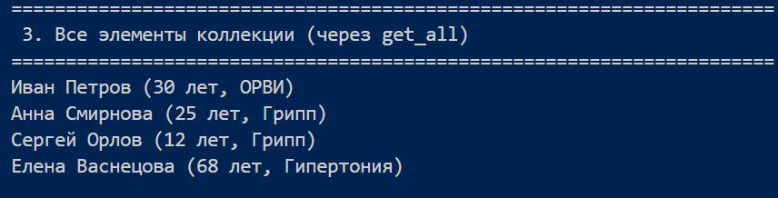
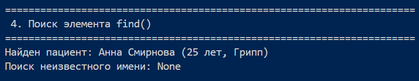
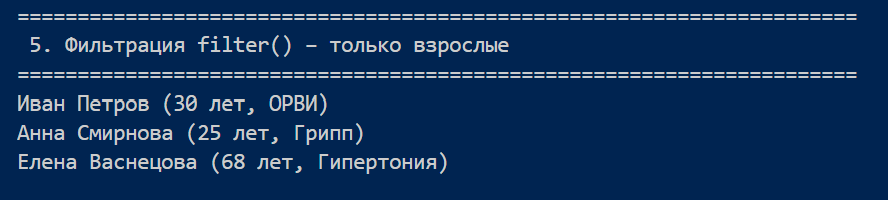
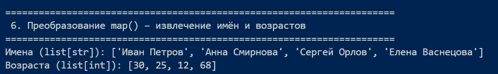
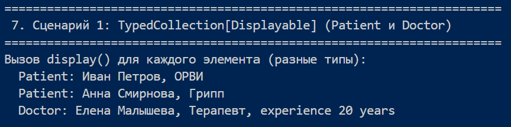
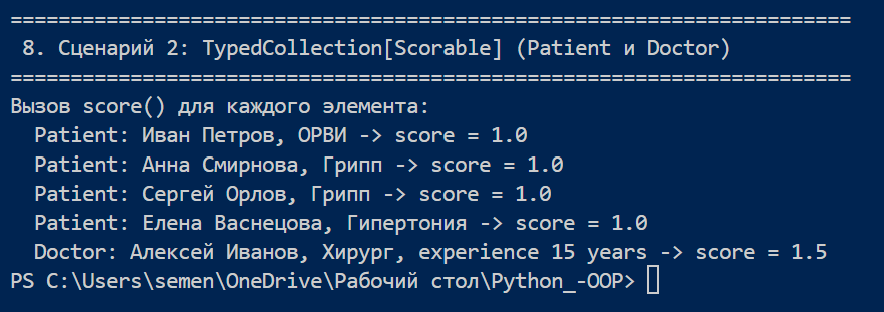

# Лабораторная работа №6: Generics, Protocol и TypeVar с ограничением

## 1. Цель работы
- Освоить аннотации типов в Python.
- Создавать обобщённые классы с помощью TypeVar и Generic.
- Понимать структурную типизацию через Protocol.
- Использовать TypeVar с ограничением (bound) для задания требований к типам.

## 2. Описание реализованных типов и контейнеров

### Протоколы
- `Displayable` – требует метод `display() -> str`.
- `Scorable` – требует метод `score() -> float`.

Классы `Patient` и `Doctor` **не наследуют** эти протоколы, но содержат необходимые методы.

### TypeVar с ограничением
- `D = TypeVar('D', bound=Displayable)`
- `S = TypeVar('S', bound=Scorable)`

### Generic-коллекция `TypedCollection`
- Параметризована типом `D` (или `S`), который обязан соответствовать протоколу.
- Реализует методы: `add`, `remove`, `get_all`, `__len__`, `__iter__`, `__getitem__`.
- Добавлены функциональные методы: `find`, `filter`, `map`, `sort_by`, `filter_by`, `apply`.

## 3. Демонстрация работы

### 1) Создание типизированной коллекции

### 2) Проверка валидации

### 3) Демонстрация элементов коллекции

### 4) Поиск элементов

### 5) Фильтраиця

### 6) извлечение имён и возрастов

### Сценарий 1: `TypedCollection[Displayable]`
- Создана коллекция, принимающая любые объекты с методом `display()`.
- Добавлены экземпляры `Patient` и `Doctor`.
- Вызван метод `display()` для каждого – вывод различается.

### Сценарий 2: `TypedCollection[Scorable]`
- Аналогично, коллекция принимает объекты с `score()`.
- Вызван `score()` для тех же объектов – получены числовые оценки.

## 4. Вывод
- Аннотации типов улучшают читаемость и позволяют статически находить ошибки.
- Generic-классы и `TypeVar` с `bound` создают типобезопасные контейнеры с ограничениями.
- Протоколы реализуют утиную типизацию без наследования, что повышает гибкость кода.
- Все требования лабораторной работы выполнены.